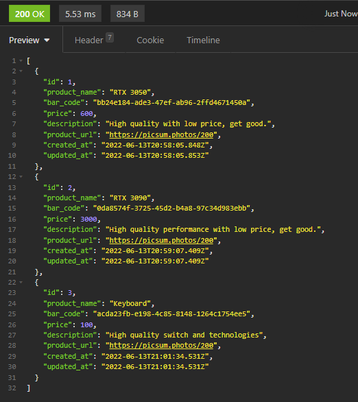
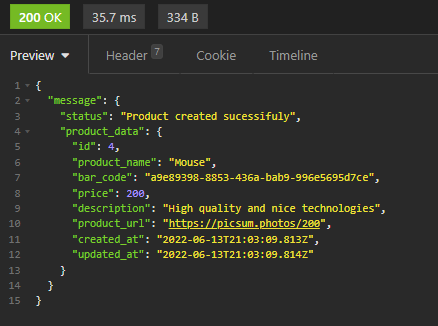
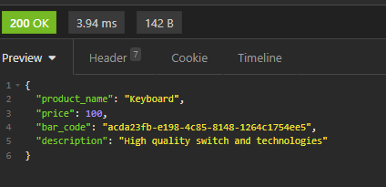

This is a simple CRUD project.

## Getting Started

run the development server:

```bash
npm run dev
# and
npx prisma studio
```

## 🐳 Create a docker mysql container

Server [http://localhost:3000/products](http://localhost:3000/products) in your browser to see the result,
With prisma you can see the database tables.

## HTTP REQUESTS

- I used insomnia while testing this project.

GET

```JSON
URL/products
```



POST

```JSON
{
	"product_name":"Mouse",
	"description":"High quality and nice technologies",
	"price":200,
	"product_url":"https://picsum.photos/200"
}
```



PUT

```JSON
//if product and id exist, will be updated.

{
	"id":1,
	"product_name":"RTX 3060",
	"description":"Awesome to play games and other things",
	"price":1000,
	"product_url":"https://picsum.photos/200"
}

```

DELETE

```JSON
//if product and id exist, will be deleted.

{
	"id":1
}
```

QUERY PARAMS

```url
URL/search?q=keyboard
```



## 🛠️ Tecnologies

```
Typescript-nodejs-prisma

```

## 📝 LICENSE

```
 The MIT License (MIT)

Copyright (c) 2015 Chris Kibble

Permission is hereby granted, free of charge, to any person obtaining a copy of this software and associated documentation files (the "Software"), to deal in the Software without restriction, including without limitation the rights to use, copy, modify, merge, publish, distribute, sublicense, and/or sell copies of the Software, and to permit persons to whom the Software is furnished to do so, subject to the following conditions:

The above copyright notice and this permission notice shall be included in all copies or substantial portions of the Software.

THE SOFTWARE IS PROVIDED "AS IS", WITHOUT WARRANTY OF ANY KIND, EXPRESS OR IMPLIED, INCLUDING BUT NOT LIMITED TO THE WARRANTIES OF MERCHANTABILITY, FITNESS FOR A PARTICULAR PURPOSE AND NONINFRINGEMENT. IN NO EVENT SHALL THE AUTHORS OR COPYRIGHT HOLDERS BE LIABLE FOR ANY CLAIM, DAMAGES OR OTHER LIABILITY, WHETHER IN AN ACTION OF CONTRACT, TORT OR OTHERWISE, ARISING FROM, OUT OF OR IN CONNECTION WITH THE SOFTWARE OR THE USE OR OTHER DEALINGS IN THE SOFTWARE.
```
